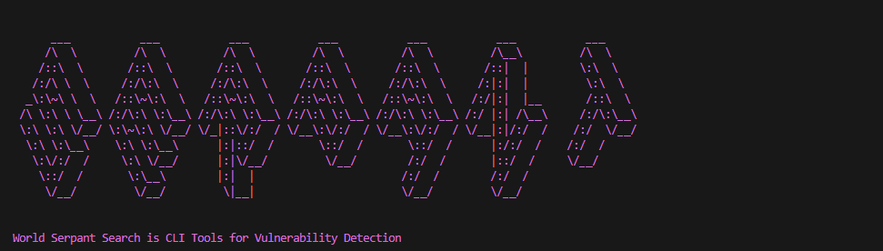
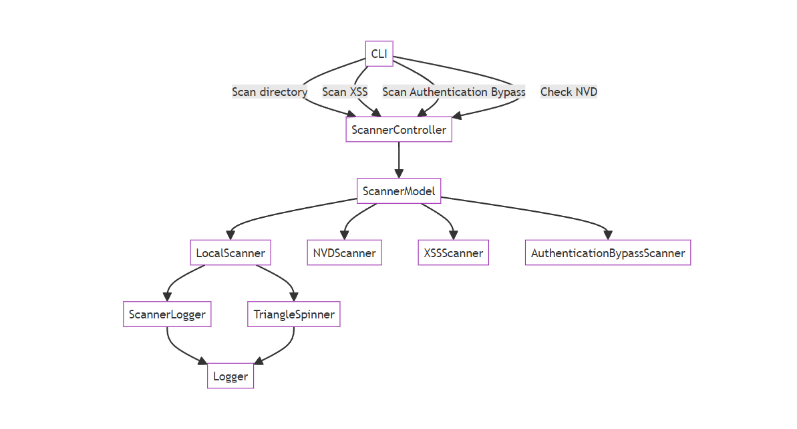

# World Serpant Search



World Serpant Search is a CLI tool for vulnerability detection. It allows you to scan directories for various types of vulnerabilities, including XSS vulnerabilities, authentication bypass vulnerabilities, and package vulnerabilities using the National Vulnerability Database (NVD).



## Installation

To install World Serpant Search, you can use pip:

```bash
pip install world-serpant-search
```

## Usage

After installation, you can run the CLI by executing the following command:

```bash
serpant
```

This will display the available commands and usage instructions.

### Commands

- `scan`: Scan a local directory for vulnerabilities.

  ```bash
  serpant scan <directory>
  ```
- `xss`: Scan a local directory for XSS vulnerabilities.

  ```bash
  serpant xss <directory>
  ```
- `abypass`: Scan a directory for authentication bypass vulnerabilities.

  ```bash
  serpant abypass <directory>
  ```
- `nvd`: Check package vulnerabilities using the National Vulnerability Database (NVD).

  ```bash
  serpant nvd <package>
  ```

## Examples

Scan a local directory for vulnerabilities:

```bash
serpant scan /path/to/directory
```

Scan a local directory for XSS vulnerabilities:

```bash
serpant xss /path/to/directory
```

Scan a directory for authentication bypass vulnerabilities:

```bash
serpant abypass /path/to/directory
```

Check package vulnerabilities using the National Vulnerability Database (NVD):

```bash
serpant nvd package-name
```

## License

This project is licensed under the MIT License - see the [LICENSE](LICENSE) file for details.
